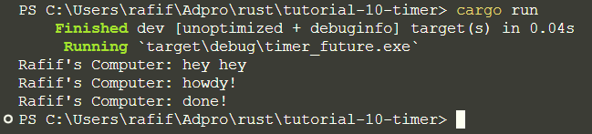

# Tutorial 10

## 1.2: Understanding how it works.

- `Rafif's Computer: hey hey` is printed synchronously from the main thread immediately after the task is spawned.
- `Rafif's Computer: howdy!` is printed from the asynchronously spawned task.
- The program then waits for two seconds due to `TimerFuture::new(Duration::new(2, 0)).await;` inside the asynchronously spawned task.
- After the two-second wait, `Rafif's Computer: done!` is printed. This completes the execution of the asynchronously spawned task.

## 1.3: Multiple spawn and removing drop.

### Before removing drop

### After removing drop

When spawning those tasks, the sequence of results may differ from the order in which they were specified in the code due to their asynchronous execution. Before we removed the drop statement, the program exited successfully. However, after removing it, the program continued running even after executing all tasks because the drop statement was still present, leading the program to expect additional tasks to be spawned.